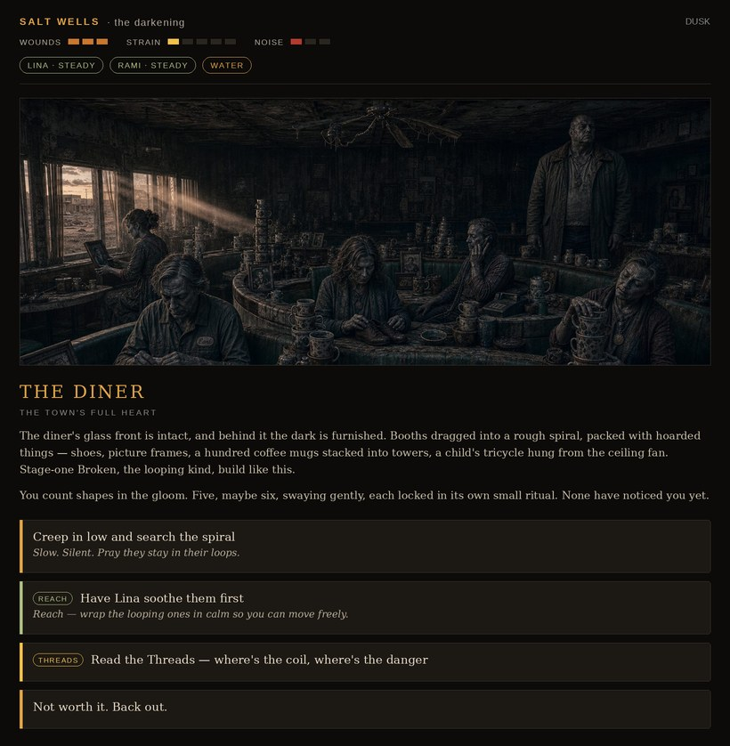

# SALT WELLS

### A text adventure set in *The Darkening*

> *Three days dry. The condenser cracked at dawn. A waymark totem points down a dead off-ramp to a highway town that should have water — and is far too quiet. Sundown is coming. So is something else.*



**Salt Wells** is a short, dark, replayable interactive fiction set during the first book of **The Darkening** trilogy. You play **Sally Adler**, seventeen, with Lina and Rami at your shoulders and an alien Compass cold in your jacket. Get in, get water, get out — past a nest of the Broken, a Scorcher patrol carrying fire, and a silence with no edge.

A full playthrough takes about **30 minutes**. There are many ways out. Most of them are bad.

---

## ▸ Play

**[Play it here](https://finosec.github.io/salt-wells/)**

Or run it locally: download the files and open **`index.html`** in any modern browser. No install, no internet required, nothing to set up.

---

## ▸ What's inside

- **Real choice.** Branching paths in the vein of classic text adventures — your decisions reshape who survives and how the night ends.
- **Three powers, each with a price.** *Read the Threads* (foresee a choice's danger), *Push* (raw kinetic force), and *Reach* (feel the living and the lost). Every use feeds a shared **Strain** meter — max it out and you don't just lose, you *slide*.
- **13 endings** — from walking out clean to fates worse than dying. Survive, escape, get trapped, use your gifts, or be swallowed by the quiet.
- **Get stuck, find a way out.** Locked doors, cornered rooms, and a nest that never sleeps — each with more than one escape, if you're clever or lucky.
- **Built to be replayed.** A persistent *endings-found* tracker rewards you for finding the better way through.
- **Atmosphere first.** Original cover-style artwork and a UI tuned to the world: amber survival light, the gold of the Compass, the grey of the Fade.

---

## ▸ Tips for the road

- You can't save everyone. The smartest survivors are the ones still alive to feel like cowards.
- Powers are tools, not solutions. Lean too hard on any of them and Salt Wells collects the difference.
- Found a good ending? Good. Now find a better one.

---

## ▸ Tech

A single self-contained `index.html` — vanilla HTML, CSS, and JavaScript, no frameworks, no build step, no tracking. The only extra assets are the images in `/art`. Works offline.

```
salt-wells-web/
├── index.html      ← the whole game
└── art/            ← scene artwork
```

---

## ▸ The world

*The Darkening* is a post-apocalyptic YA sci-fi/fantasy trilogy. Ten years ago a signal from beneath the Martian surface killed every digital system on Earth and changed the minds of the survivors — some *Awakened* into power, some *Broken* by it. What remains is a world of firelight, blades, barter, and warring factions: the iron order of the **Regulus Pact**, the rooted resistance of the **Loam**, and the purifying fire of the **Scorchers**. *Salt Wells* is one bad night on the long road east.

---

## ▸ Credits

Story, world, and *The Darkening* © Bolshoy. All rights reserved.
Built as a wayside tale within the series. Please don't redistribute or adapt without permission.
